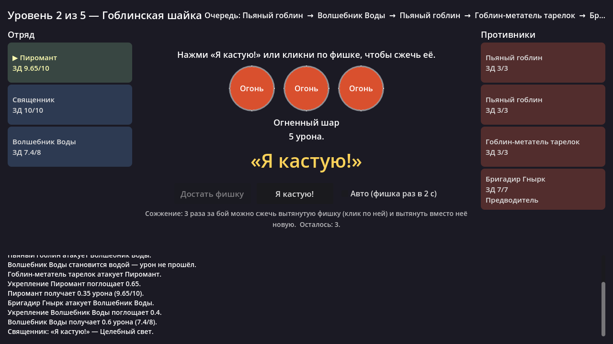
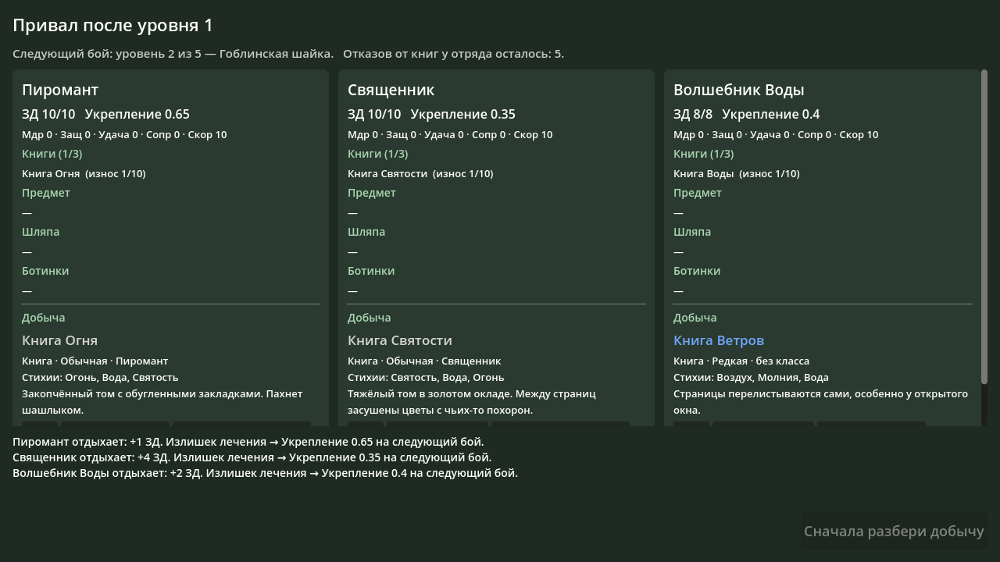

# Я кастую (I am spellcast)

Цифровая кооперативная игра про трёх волшебников, которые колдуют из книг случайные заклинания.
Можно играть в соло, переключаясь между всеми тремя героями. 20 уровней, 100 противников.

- Дизайн-документ: [docs/GDD.md](docs/GDD.md)
- Бестиарий: [docs/enemies.md](docs/enemies.md)
- Боссы: [docs/bosses.md](docs/bosses.md)
- Банды с предводителями: [docs/gangs.md](docs/gangs.md)
- Баланс и эффекты: [docs/balance.md](docs/balance.md)
- Обмундирование: [docs/equipment.md](docs/equipment.md)
- Книги заклинаний (26 книг, таблицы и шансы): [docs/spells/README.md](docs/spells/README.md)

Таблицы книг хранятся в `data/books/*.json`. После правки пересоберите документы:

```
python3 tools/gen_spells.py
```

## Прототип в Godot

Проект Godot лежит в корне репозитория (`project.godot`) и читает книги прямо из `data/books`.
В прототипе — **акт I целиком**: 4 уровня с бандами и босс Крысиный Король на 5-м.
Между уровнями — привал: отдых (75 % ЗД + Укрепление), лут и инвентарь.




**Как запустить**
1. Скачай ветку репозитория (`git clone` или ZIP на GitHub) и распакуй.
2. Открой Godot (4.5 или новее) → **Import** → выбери `project.godot` → **Import & Edit**.
3. Нажми **F5** (Run Project).

**Как играть**
- На ходу волшебника кликни по карточке цели — врагу или союзнику.
- Жми **«Достать фишку»** три раза (или включи «Авто» — фишка раз в 2 секунды).
- Пиромант может кликнуть по вытянутой фишке, чтобы сжечь её и вытянуть новую (3 раза за бой).
- Жми **«Я кастую!»**. Заклинание сработает на выбранную цель, даже если выпало «не то».
- Если у волшебника есть предмет, в начале его хода появится кнопка **«Предмет: …»**
  (ход не тратится).
- На привале разбери добычу у каждого: взять, заменить книгу, отдать союзнику,
  выбросить или отказаться (у отряда 5 отказов от книг на всё приключение).
  Кнопка «В бой!» включится, когда всё разобрано.

**Структура**
- `scripts/core/` — логика без графики: бой (`combat.gd`), приключение, отдых и лут
  (`adventure.gd`), волшебник между боями (`wizard.gd`), мешочек фишек, разбор эффектов, ИИ.
- `scripts/ui/` — экраны: `game.gd` (переходы), `battle_ui.gd` (бой), `camp_ui.gd` (привал).
- `data/classes/`, `data/encounters/`, `data/adventure/act1.json` — классы, бои, настройки акта
  (шансы лута, 75 % отдыха, параметры Укрепления).
- `data/items.json`, `data/equipment.json` — предметы, шляпы и ботинки.
- `tests/` — тесты и симулятор.

**Тесты и симулятор** (из папки проекта, `godot` — путь к исполняемому файлу Godot;
на Windows — версия с `_console.exe`):

```
godot --headless --path . --script res://tests/run_tests.gd
godot --headless --path . --script res://tests/ui_smoke.gd
godot --headless --path . --script res://tests/simulate.gd -- encounter=rat_pack n=3000
godot --headless --path . --script res://tests/simulate_act.gd -- n=500
```
